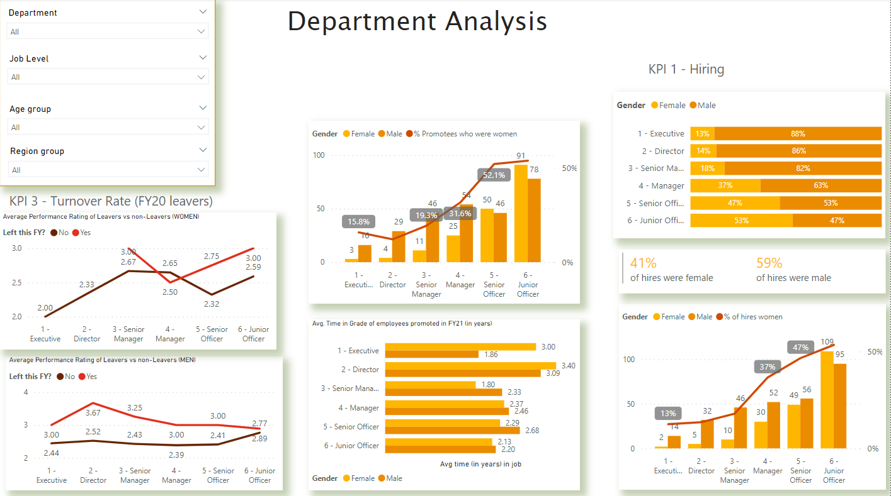
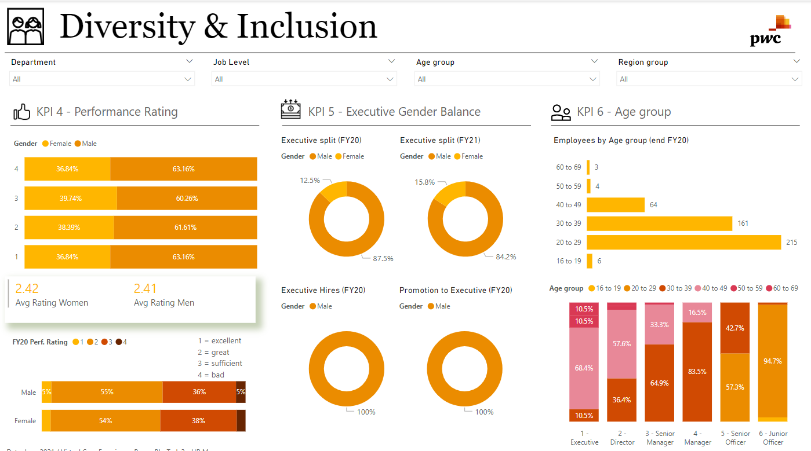

# PwC-Switzerland---Power-BI-Job-Simulation

# Customer Retention and Call Center Performance Dashboard

## Overview
This dashboard provides a comprehensive analysis of customer retention and call center performance, focusing on churn rates, customer tenure, monthly charges, call volume, agent performance, response times, and customer satisfaction.

## Features

### Key Performance Indicators (KPIs)
- **Customer Retention:**
  - Churn Rate: Percentage of customers who have churned.
  - Average Tenure: Average duration in months that a customer stays with the company.
  - Average Monthly Charges: Average amount billed to customers per month.
- **Call Center Performance:**
  - Total Calls
  - Total Answered Calls
  - Total Unanswered Calls
  - Total Resolved Calls
  - Average Speed of Answer
  - Average Talk Duration
  - Average Satisfaction Rating

### Visualizations

#### Customer Retention
- **Churn Rate Pie Chart**: Percentage of churned vs. non-churned customers.
- **Average Tenure Bar Chart**: Distribution of customer tenure.
- **Revenue Distribution Histogram**: Distribution of total charges.
- **Subscription Rates Stacked Bar Chart**: Rates for various services.
- **Contract Types Pie Chart**: Distribution by contract type.
- **Support Tickets Bar Chart**: Average number of administrative and technical tickets.
- **Churn Correlation Scatter Plot**: Relationship between support tickets and churn rate.
- **Churn Rates by Demographics Bar Charts**: Churn rates by gender, senior citizen status, partner status, and dependents.
- **Churn Rates by Tenure Line Graph**: Churn rates across different tenure lengths.
- **Revenue by Contract Type Bar Chart**: Average monthly charges by contract type.

#### Call Center Performance
- **Call Volume Over Time**: Line Chart showing trends.
- **Agent Performance Comparison**: Bar Chart comparing metrics.
- **Calls by Topic**: Pie Chart of call topics.
- **Answered vs. Unanswered Calls**: Pie Chart of call outcomes.
- **Resolved vs. Unresolved Calls**: Pie Chart of resolution status.
- **Satisfaction Rating Distribution**: Histogram of ratings.
- **Average Satisfaction Rating Over Time**: Line Chart showing trends.
- **Satisfaction Rating by Agent**: Bar Chart comparing agents.
- **Satisfaction Rating by Topic**: Bar Chart comparing topics.
- **Resolved Calls vs. Satisfaction Rating**: Box Plot of ratings.
- **Satisfaction Rating Heatmap**: Heatmap of ratings by date and time.

